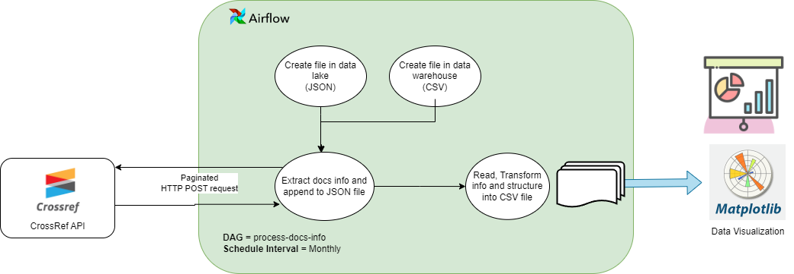

#ETL Project to get data from CrossRef API

## Overall Architecture

The following project is to develop a Data Pipeline to get data from Crossref API, which is the most recognized API to get 
metadata information from a huge amountof scholar and scientific publications (articles, papers, proceedings, journals, etc.).
apply transformations to the unstructured data coming in JSON format, and extract meaningful data to load it into CSV 
files. Due to the large amount of data that is fed constantly on Crossref.

The pipeline is designed as an Airflow DAG, with a monthly scheduled , so thedata is ingested without overload the 
data repositories. Right now the DAG is designed to obtain information of the last year on a monthly basis, but those 
settings can be adjusted in the DAG itself



## Setup

Following are the instruction

### Pre-requisites:

Docker and Docker Compose should be installed on your system. You can download them from the official website: https://www.docker.com/products/docker-desktop .


### Steps:

1. Clone this GitHub repository:
`git clone https://github.com/javiersan2911/Data-Engineering-Test.git`
2. Define the environment variables:
```
AIRFLOW_UID=50000
AIRFLOW_VERSION=2.8.3
```
3. Modify the file *files/var.json* replacing the values of `SEARCH_TERM_OR_TOPIC`, `MAIL_TO` and `PAGE_SIZE`

 ```
 {
  "search_terms": "<<<SEARCH_TERM_OR_TOPIC>>>",
  "http_api_settings": {
    "base_url": "https://api.crossref.org/works",
    "params": {
      "sort": "score",
      "order": "desc",
      "mailto": "<<MAIL_TO>>",
      "rows": <<PAGE_SIZE>>,
      "offset": 0
    },
    "headers": {
      "User-Agent": "Airflow/2.8.3 (mailto:<<MAIL_TO>>)"
    },
    "filter_fields": "type:monograph,type:journal-article,type:journal-volume,type:proceedings-article,type:proceedings,type:journal-issue,type:dissertation"
  }
}
```

4. Initialize the Airflow database with the command: `docker compose up airflow-init`
5. Start the Docker containers: `docker-compose up`
6. The pipeline should now be running and fetching data from Crossref. You can check the logs of the various components to verify this.
7. Any additional libraries can be added to the `requirements.txt` file

## Exploratory Data Analysis

A little brief on insights obtained from ingested data is on the following notebook:

[Publication Analysis EDA](eda%2FPublication%20Analysis.ipynb)

## Integration

The DAG configuration, scheduling and running can be done through the REST API exposed on the Airflow container:
More information [here](https://airflow.apache.org/docs/apache-airflow/stable/stable-rest-api-ref.html)

